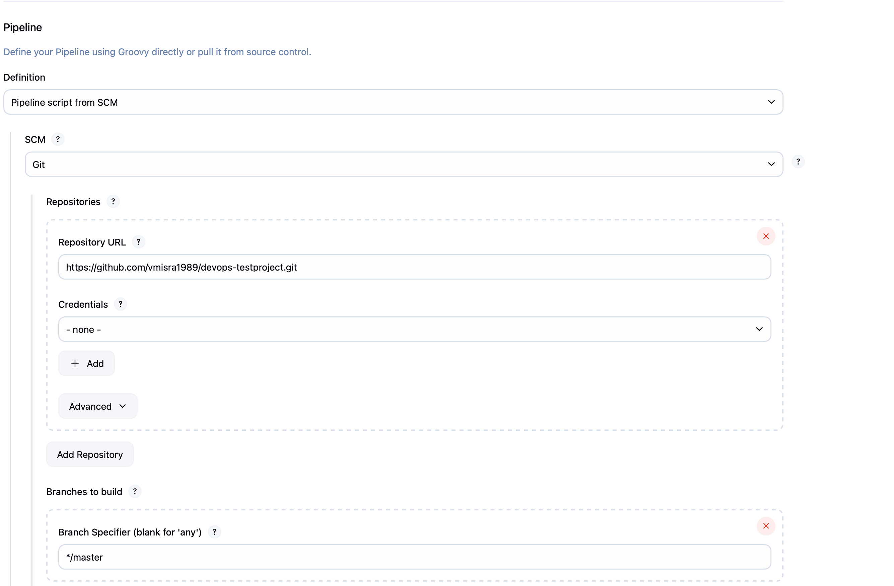
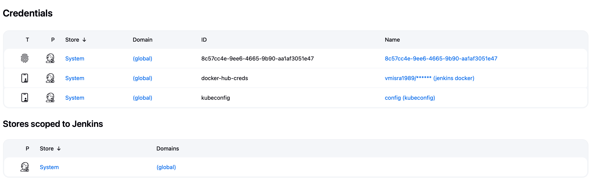

# devops-testproject
CI/CD test pipeline using Github + Jenkins + Docker + Minikube

## Overview
This project demonstrates a CI/CD pipeline using GitHub, Jenkins, Docker, and Minikube. The pipeline is designed to automate the process of building, testing, and deploying applications.

## Prerequisites
- Jenkins, Docker, and Minikube are installed locally on macOS. Jenkins is not installed as container and also docker daemon in minikube is not being used rather, we are storing images in docker hub and pulling diretly from there.

## Pipeline Steps
1. **GitHub Integration**: Code is pushed to a GitHub repository.
2. **Jenkins**: Jenkins is configured to pull the latest code from GitHub, build the Docker image, and run tests.
3. **Docker**: Docker is used to containerize the application.
4. **Minikube**: Minikube is used to deploy the application to a local Kubernetes cluster.

## Setup Instructions
1. Install Jenkins, Docker, and Minikube on your macOS.
2. Configure Jenkins to connect to your GitHub repository.
3. Integrate Jenkins to docker using credentials by adding credentials in Jenkins from docker. 
4. Integrate minikube to Jenkins using secret file by uploading .kubeconfig file and putting location of kubeconfig file in the Jenkinsfile. There are various other ways to integrate if Jenkins and minikube are not installed locally.
5. Create a Jenkins pipeline to build and test the Docker image.

6. Deploy the Docker image to Minikube.
7. Credentials in Jenkins look like:

8. Make sure to use correct IDs in Jenkinsfile. Eg: docker-hub-creds was used as ID in Jenkins as docker hub credentials.

## Usage
- Push code changes to the GitHub repository.
- Jenkins will automatically build, test, and deploy the application.

## Troubleshooting
- Check Jenkins logs for build and test errors.
- Use `kubectl` commands to manage and troubleshoot the Kubernetes pods.

## Conclusion
This project provides a basic setup for a CI/CD pipeline using GitHub, Jenkins, Docker, and Minikube on macOS.

## Errors and the steps followed to rectify them.
1. docker tag vmisra1989/myapp_test:latest vmisra1989/myapp_test:latest. Error response from daemon: No such image: vmisra1989/myapp_test:latest

The name of the image was incorrect in Jenkinsfile, modified it.

2. kubectl apply -f k8s/deployment.yaml
error: error validating "k8s/deployment.yaml": error validating data: failed to download openapi: Get "https://127.0.0.1:50630/openapi/v2?timeout=32s": dial tcp 127.0.0.1:50630: connect: connection refused; if you choose to ignore these errors, turn validation off with --validate=false 

This confirms that kubectl is trying to connect to the Kubernetes API server at 127.0.0.1:50630, but Jenkins cannot reach it.
minikube status

minikube
type: Control Plane
host: Stopped
kubelet: Stopped
apiserver: Stopped
kubeconfig: Stopped

minikube start- Started the minikube services.

Also, added the secret key in jenkins and uploaded /.kube/config file as secret. 

3. Also, there was error in the beginning that Jenkins service was not running, so turned out that another process was running on port 8080, so modified the httpport for Jenkins to 8443 using the following command.
/usr/local/Cellar/openjdk@21/21.0.7/libexec/openjdk.jdk/Contents/Home/bin/java -jar /usr/local/opt/jenkins-lts/libexec/jenkins.war --httpPort=8443 --enable-future-java

4. The Deployment "myapp-deployment-test" is invalid: spec.template.metadata.labels: Invalid value: map[string]string{"app":"myapp"}: `selector` does not match template `labels`
[Pipeline] }
[Pipeline] // stage
[Pipeline] }
[Pipeline] // withEnv
[Pipeline] }
[Pipeline] // withEnv
[Pipeline] }
[Pipeline] // node
[Pipeline] End of Pipeline
ERROR: script returned exit code 1
Finished: FAILURE

It means that the labels in the pod template do not match the selector defined in the Deployment. Kubernetes uses the selector to know which pods the Deployment should manage, and they must match exactly.

Modified it to match so that Deployment is aware of the pod, it has to manage. 

5. NAME                                     READY   STATUS             RESTARTS      AGE
myapp-deployment-test-7557548d6f-ff5fq   0/1     CrashLoopBackOff   2 (21s ago)   44s
Also, there were no pod logs. 

spec:
      containers:
      - name: myapp
        image: vmisra1989/myapp_test:latest
        ports:
        - containerPort: 3000

If the Docker image vmisra1989/myapp_test:latest:

doesn't start a long-running process (like a web server), or has a default command that exits immediately, then the container will start, exit, and trigger a CrashLoopBackOff.

This is mostly fine, but there's no command or args specified, which means Kubernetes will use the default CMD or ENTRYPOINT from the Docker image and in the docker image, I forgot to add CMD, so it was causing CrashLoopBackOff. at the end of dockerfile added CMD ["./test.sh"]

As the container was starting and  quickly, so added sleep infite to the shell script which was supposed to be containerized. 

6. Additional Information:
If there is already a container with the same name which is crashing and going to crashloopback, and if another container with the sme name is deployed with minor changes in the script file, would it be shown in the kubectl get pods command or not ? As I was not able to see it untill I removed already existing pod:

Kubernetes Behavior with Same Deployment Name
If you deploy a new container (e.g., with a modified script) but use the same Deployment name, Kubernetes does not create a new pod alongside the old one. Instead, it:

Updates the existing Deployment.
Terminates the old pod(s).
Creates new pod(s) with the updated configuration.
However, if the new pod also crashes (e.g., due to the same script issue), it may look like nothing changed, because:

The pod name is similar (but not identical).
The new pod enters CrashLoopBackOff quickly.
You might not notice the rollout unless you check the timestamps or logs.

Why You Didn't See the New Pod

That likely happened because:

You updated the image or script but didn’t trigger a rollout (e.g., via kubectl rollout restart).
Kubernetes didn’t detect a change in the Deployment spec (e.g., if the image tag was still latest and not re-pulled).
The pod name looked similar, and the new pod crashed just like the old one.

## In next release
There are many possibilities to make it better slowly. Couple of them which will be implemented in next version of this project:
1. Keep github repo private and integrate Jenkins with github repo.
2. Make user and groups for each component with appropriate permissions. 
3. Integrating testing tools with Jenkins using plugins.
4. Better comments while commiting to the branch in github.
5. More components in Kubernetes like various kind of services, stateful sets, config maps and DaemonSets will be used.