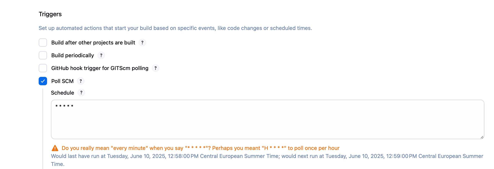
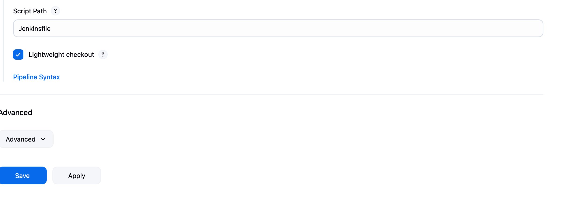

# devops-testproject
CI/CD test pipeline using Github + Jenkins + Docker + Minikube

## Overview
This project demonstrates a CI/CD pipeline using GitHub, Jenkins, Docker, and Minikube. The pipeline is designed to automate the process of building, testing, and deploying applications.

## Prerequisites
- Jenkins, Docker, and Minikube are installed locally on macOS. Jenkins is not installed as container and also docker daemon in minikube is not being used rather, we are storing images in docker hub and pulling diretly from there.

## Pipeline Steps
1. **GitHub Integration**: Code is pushed to a GitHub repository.
2. **Jenkins**: Jenkins is configured to pull the latest code from GitHub, build the Docker image, and run tests.
3. **Docker**: Docker is used to containerize the application.
4. **Minikube**: Minikube is used to deploy the application to a local Kubernetes cluster.

## Setup Instructions
1. Install Jenkins, Docker, and Minikube on your macOS.
2. Configure Jenkins to connect to your GitHub repository.
3. Integrate Jenkins to docker using credentials by adding credentials in Jenkins from docker. 
4. Integrate minikube to Jenkins using secret file by uploading .kubeconfig file and putting location of kubeconfig file in the Jenkinsfile. There are various other ways to integrate if Jenkins and minikube are not installed locally.
5. Create a Jenkins pipeline to build and test the Docker image.

6. Deploy the Docker image to Minikube.
7. Credentials in Jenkins look like:

8. Make sure to use correct IDs in Jenkinsfile. Eg: docker-hub-creds was used as ID in Jenkins as docker hub credentials.

## Usage
- Push code changes to the GitHub repository.
- Jenkins will automatically build, test, and deploy the application.

## Troubleshooting
- Check Jenkins logs for build and test errors.
- Use `kubectl` commands to manage and troubleshoot the Kubernetes pods.

## Conclusion
This project provides a basic setup for a CI/CD pipeline using GitHub, Jenkins, Docker, and Minikube on macOS.

There are many possibilities to make it better slowly. Couple of them are :
1. Keep github repo private and integrate Jenkins with github repo.
2. Integrating testing tools with Jenkins using plugins. 
3. 